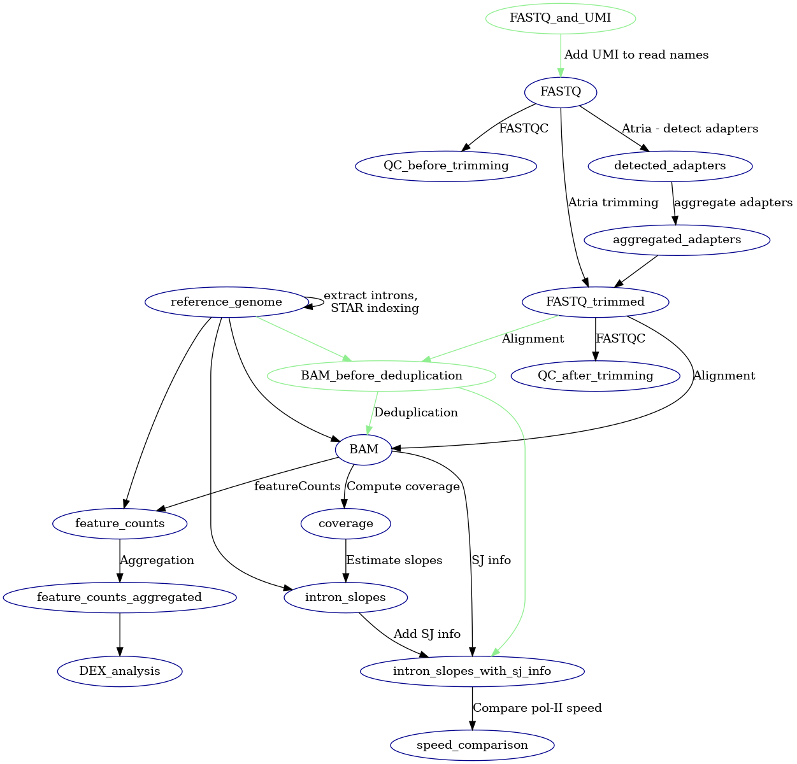

# pol-II-analysis

This repository contains a pipeline for processing total or nascent RNA-seq data,
focusing on analysis related to the RNA Polymerase II (pol-II).

Currently, it focuses on the calculation of pol-II speed, based on the paper
[Debès, Cédric, et al. "Ageing-associated changes in transcriptional elongation influence longevity](https://www.nature.com/articles/s41586-023-05922-y).
In the future, we plan to extend this repository to analyze other phenomenas related to pol-II.

## Overview
This repository implements a pipeline for processing  total or nascent RNA-seq data. 
The pipeline consist of multiple steps, and can be visualized as the following computational graph:

Each node in the graph represent a folder with a data, and edges represent the dependencies - all parent nodes are required to create
the given child node.

The starting point is assumed to be the ```FASTQ``` folder, containing the un-processed reads. 
In a case that your data are already processed, you may run only the corresponding part of pipeline 
(e.g. if your FASTQ data are already trimmed, you may skip the trimming steps 
implemented in this repository and start from the ```FASTQ_trimmed``` folder.)

All the processing steps are run through Docker. We provide [Dockerfiles](./dockerfiles) used to build the Docker images.

Currently, the code is run by executing shell scripts in the [pipeline](./pipeline) folder, 
where each script compute one step (node in the computational graph). The scripts have
an option to either run the computation locally, or submit it via
```sbatch``` command as a jobs to a queue of Slurm Workload Manager.

## Setup
The folder [misc](./misc) provide several utility scripts used for initial setup. 
These steps are not specific for a given dataset.
1. **Building the docker images**: As a first step, execute the script 
[misc/build_images.sh](misc/build_images.sh), which will build docker images
used in the pipeline. The images will be also saved as a ```.tar``` files to a disk.
2. **Genome indexing**: We are using [STAR](https://github.com/alexdobin/STAR) 
for read alignment in the pipeline. Before running the alignment step,
it's necessary to prepare STAR index. 
To do that, run the script [misc/prepare_star_index.sh](misc/prepare_star_index.sh). 
The script require the annotation ```.gtf``` file and the genome sequence ```FASTA``` file to be placed
in given folder, passed as an argument to the script. The script will generate a subfolder 
named ```STAR_index``` in the genome folder.
3. **Extracting introns from the .gtf file**: Run the script [misc/extract_genomic_features.sh](misc/extract_genomic_features.sh),
which will extract the introns from the ```.gtf``` file and save them separately (as a ```.bed``` file)
to the genome folder. As ```.gtf``` from different sources ([Ensembl](https://www.ensembl.org/index.html) 
resp. [Gencode](https://www.gencodegenes.org/)) differ in their naming of UTR
features (Ensembl distinguish ```3_prime_utr``` and ```5_prime_utr```, while Gencode names both as ```UTR```),
the type of ```.gtf``` file must be provided as an argument to the script (```ensembl``` or ```gencode``` ).
## Workflow
